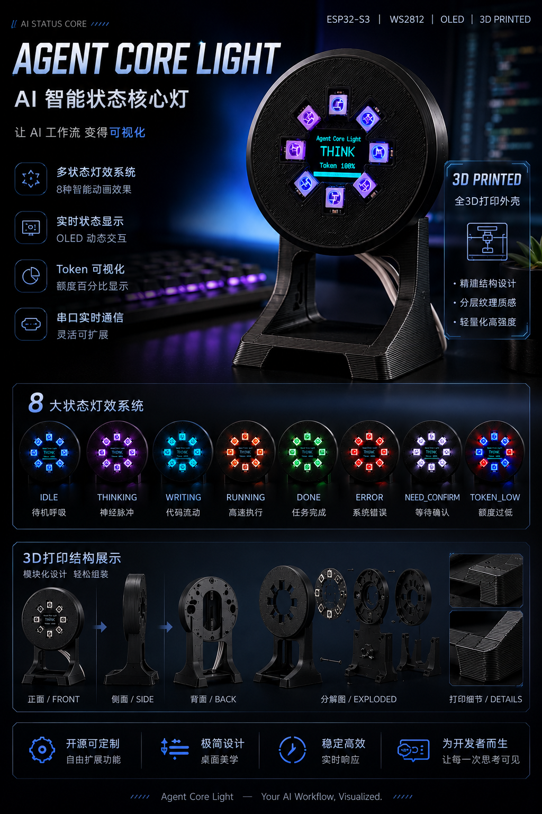

# AgentCore-Light

一个可开源复用的桌面状态灯项目：用 **ESP32-C3 Mini + WS2812 8灯环 + SSD1306 OLED+ 蜂鸣器** 显示 Codex 工作状态和 5h Token 百分比。

> A BLE-powered status light for Cursor Agent, using ESP32-C3 to visualize AI coding states.




---

## 1、项目简介

AgentCore-Light 将一个ESP32 -C3 结合Agent 改造成可由电脑控制的桌面状态灯。

核心思路：

- 使用 **ESP32-C3 SuperMini** 作为主控。
- 外设WS2812 8灯环 + 0.96 OLED+ 蜂鸣器。
- 通过 **BLE 蓝牙/串口/网络** 接收电脑端脚本发送的状态指令。
- 结合 Agent Hooks，让 Agent 的工作状态自动映射到灯效。

## 2、功能特性

- 串口命令控制状态：
  - `IDLE`
  - `THINKING`
  - `WRITING`
  - `RUNNING`
  - `DONE`
  - `ERROR`
  - `NEED_CONFIRM`
  - `TOKEN:x`
- OLED 显示：
  - `Codex`
  - 当前状态（大字）
  - `Token xx%` + 进度条
- OLED 支持 180° 旋转，且使用中间横向安全区（适配外壳遮挡）
- 全部动画基于 `millis()` 非阻塞，串口命令可随时打断
- 提供 Codex Hook 到串口桥接脚本

---

## 3、硬件清单

| 类别 | 物料                         | 数量   | 说明                              |
| ---- | ---------------------------- | ------ | --------------------------------- |
| 主控 | ESP32-C3 SuperMini 开发板    | 1 块   | 建议购买未焊针版本，方便塞到外壳  |
| 核心 | 0.96 OLED显示屏              | 1 只   | 建议购买未焊针版本，方便塞到外壳  |
| 核心 | WS2812 8灯环                 | 1 个   | PDD购买，和视频同款就行           |
| 核心 | 蜂鸣器                       | 1 个   | 有源蜂鸣器（低电平有效），PDD购买 |
| 螺丝 | M2*10                        | 4 个   | 主要固定产品后盖                  |
| 螺丝 | M3*5                         | 3 个   | 主要固定产品蜂鸣器，OLED          |
| 连线 | 电子导线                     | 若干   | 直接PDD买，不要太粗的，不方便     |
| 工具 | 电烙铁、焊锡丝、镊子、螺丝刀 | -      | 需要有焊接基础                    |
| 检测 | 万用表                       | 非必须 | 用于确认焊点和短路                |


## 4、接线

| WS2812 | 名称     | ESP32 引脚 |
| ------ | -------- | ---------- |
| DI     | 数据输入 | GPIO4      |
| GND    | 地线     | GND        |
| VCC    | 供电     | 5V         |


| OLED | 名称       | ESP32 引脚 |
| ---- | ---------- | ---------- |
| SDA  | IIC 数据位 | GPIO8      |
| SCL  | IIC 时钟位 | GPIO9      |
| VCC  | 供电       | 3.3V       |
| GND  | 地线       | GND        |


| 蜂鸣器 | 名称                 | ESP32 引脚 |
| ------ | -------------------- | ---------- |
| DI     | 数据输入（低电平响） | GPIO3      |
| VCC    | 供电                 | 3.3V       |
| GND    | 地线                 | GND        |

---

## 5、 项目结构

```text
codex-agent-status-light/
├─ firmware/
│  └─ esp32s3_codex_status_light.ino
├─ host/
│  ├─ codex_light_serial.py
│  ├─ codex_light_hook.py
│  ├─ start_codex_light_daemon.ps1
│  ├─ set_token_percent.ps1
│  ├─ calibrate_token_budget.py
│  └─ agent_light_control.py
├─ hooks/
│  └─ hooks.json.example
├─ docs/
│  ├─ QUICKSTART_CN.md
│  └─ TROUBLESHOOTING_CN.md
├─ requirements.txt
├─ .gitignore
└─ LICENSE
```

---

## 6、技术栈

- 固件：Arduino Framework（ESP32）
- 灯环：Adafruit NeoPixel
- OLED：Adafruit SSD1306 + Adafruit GFX + Wire
- 主机端：Python 3 + pyserial + 本地 TCP daemon
- 自动联动：Codex Hooks（命令回调脚本）

---

## 7、快速开始

详细步骤见 [docs/QUICKSTART_CN.md](docs/QUICKSTART_CN.md)。

最短流程：

1. Arduino IDE 打开 `firmware/esp32s3_codex_status_light.ino` 并上传到 ESP32-C3  
2. 安装 Python 依赖：`pip install -r requirements.txt`  
3. 启动 daemon：`host/start_codex_light_daemon.ps1`  
4. 先手动发送命令测试：`py -3 host/codex_light_serial.py send THINKING`  
5. 配置并启用 Codex hooks（参考 `hooks/hooks.json.example`）

---

## 8、状态映射（当前实现）

- `UserPromptSubmit` -> `THINKING`
- `PreToolUse`
  - `apply_patch` -> `WRITING`
  - 其他工具 -> `RUNNING`
- `PostToolUse` -> `THINKING`（失败时 `ERROR`）
- `Stop` -> `DONE`（固件 10 秒后自动回 `IDLE`）
- `SessionStart` -> `IDLE`

---

## 7. Token 百分比说明

当前可用两种方式：

1. 手动精确同步（推荐）  
`powershell -File host/set_token_percent.ps1 15`

2. 自动估算同步（可选）  
`codex_light_hook.py` 可基于本地 `tokens_used` 估算百分比（并非官方剩余额度精确值）。

---

## 9、已实现灯效设计

- `IDLE`：深蓝柔和呼吸 + 按 tokenPercent 亮灯数量
- `THINKING`：紫色神经脉冲旋转（轻微快慢变化）
- `WRITING`：青蓝数据流追逐
- `RUNNING`：橙红双亮点高速扫描
- `DONE`：青绿色扩散波 10 秒
- `ERROR`：随机红色故障闪烁
- `NEED_CONFIRM`：白色双闪+暂停
- `TOKEN_LOW`（`tokenPercent < 10`）：IDLE 下低频红蓝提醒

---

## 10、常见问题

见 [docs/TROUBLESHOOTING_CN.md](docs/TROUBLESHOOTING_CN.md)。

---

## 11、后续可扩展方向 （马上更新）

- BLE / Wi-Fi 控制通道
- 精确官方剩余额度 API 同步
- 多设备状态广播
- 桌面托盘 App（无终端运行）
- claude
- cursor

# 开源协议（License）

本项目采用 MIT License 开源协议。

这意味着你可以：

- 免费使用本项目代码
- 修改项目源码
- 将项目用于个人学习或商业项目
- 分发、转载或二次开发本项目
- 将本项目集成到其他软件中

但需要遵守以下条件：

- 保留原作者版权声明
- 标注作者声明
- 保留 MIT License 协议内容
- 在引用或分发本项目时附带原始许可证文件

## 免责声明

本项目按“现状（AS IS）”提供，不提供任何形式的明示或暗示担保，包括但不限于适销性、特定用途适用性及非侵权保证。

作者不对因使用本项目而产生的任何直接或间接损失承担责任。

## 作者

BuildFPGA

邮箱：1975670198@qq.com

## 欢迎

欢迎 Star、Fork 以及提交 Issue 和 Pull Request，共同完善项目。

MIT，见 [LICENSE](LICENSE)。
